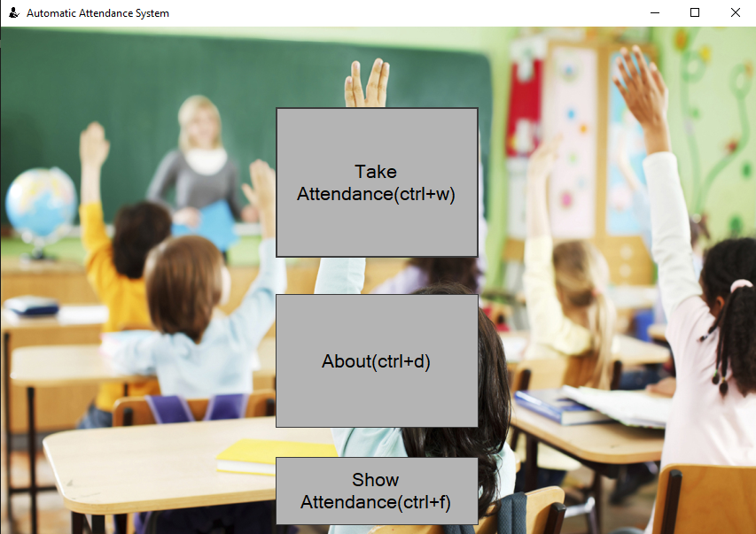
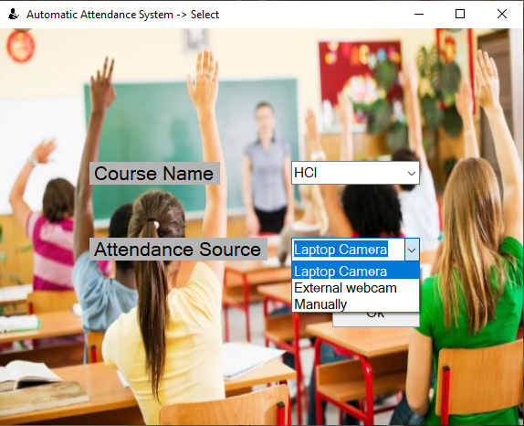
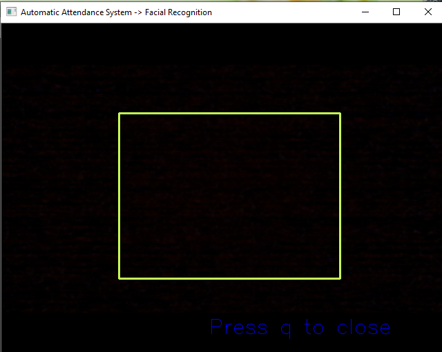
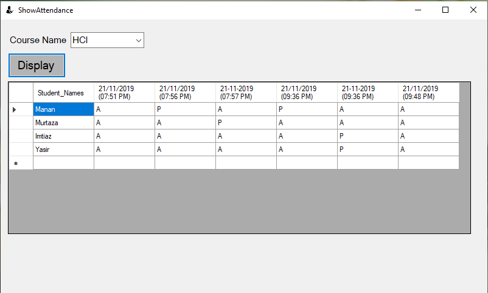

# HCI
Automatic attendance system using facial recognition

## Dependencies: 
opencv 
face recognition 
opencv 
imutils 
argparse 
pickle 
sys 
csv 
pandas 
datetime 
numpy 

 

## Requirements: 
A code editor(We used Visual Studio code) 
Visual studio with C# installed 
The images will have to be uploaded in the dataset folder 
2 images per person will be enough 
run encodeface.py to obtain encodings file 
A GPU is preferred 

The paths will have to be changed in the windows form and the recognize_video.py script 

## Interface 
 
   
 
## Acknowledgements
https://www.pyimagesearch.com/2018/06/18/face-recognition-with-opencv-python-and-deep-learning/

