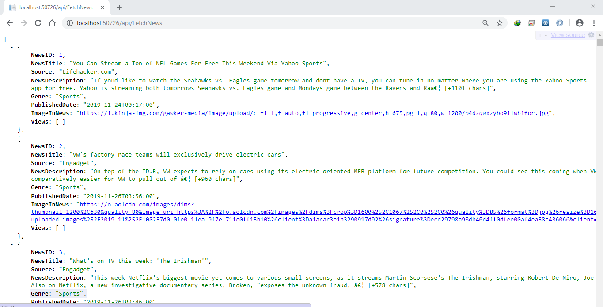

# SmartNews
A news reading app which displays time constrained news from a web API. User specifies the time at login time and the news are fetched that can be read in the specified time limit 

### Interface

  
   
   
  
   
  

